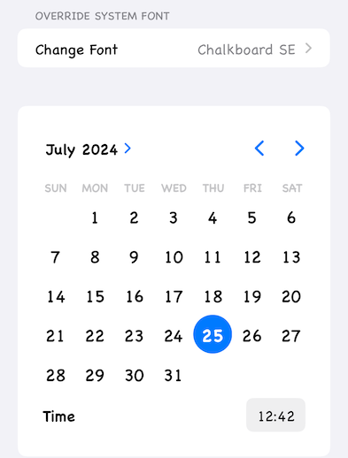

# SystemFontOverride

Easy font branding for your iOS app.

[![Swift Version][swift-image]][swift-url]
[![License][license-image]][license-url]
[](https://img.shields.io/cocoapods/v/SystemFontOverride.svg)
[](http://cocoapods.org/pods/SystemFontOverride)
[](http://makeapullrequest.com)



## Features

* Override the default system font with your own branded font.
* Compatible with both UIKit and SwiftUI.
* Simple and intuitive API for quick integration.

## Usage

Instant font branding, automatically overriding system font:

```swift
UIFont.systemFontFamilyOverride = "Marker Felt" // replace with appropriate font
```

Explicitly specify font in UIKit:

```swift
someUIKitElement.font = .systemFontOverride(size: 16)
```

Explicitly specify font in SwiftUI:

```swift
someSwiftUIView
    .font(.systemOverride(size: 16))
```

## Installation

### CocoaPods:

```ruby
pod 'SystemFontOverride'
```

### Swift Package Manager:

```swift
dependencies: [
    .package(url: "https://github.com/yonat/SystemFontOverride", from: "1.0.0")
]
```

## Limitations

Most UI elements will just work with the override font.

However, a few elements completely ignore the override:
- Sheet presented by `ColorPicker` or `UIColorWell`

Additionally, some SwiftUI controls require explicit `.font()` modifier to update their title font:
- `Picker`
- `Menu`
- `Toggle`
- `bordered` and `borderedProminent` button styles
- `Label` in some contexts

See the Demo app for details.

## Mechanism

To automatically override the system font, SystemFontOverride uses [method swizzling](https://developer.apple.com/documentation/objectivec/1418769-method_exchangeimplementations) for `UIFont.systemFont(ofSize:)` and related methods.

Segmented controls and `UITextField` ignore the system font override, but their `appearance()` proxy correctly sets their titles to the override font. 

[swift-image]:https://img.shields.io/badge/swift-5.0-orange.svg
[swift-url]: https://swift.org/
[license-image]: https://img.shields.io/badge/License-MIT-blue.svg
[license-url]: LICENSE.txt
